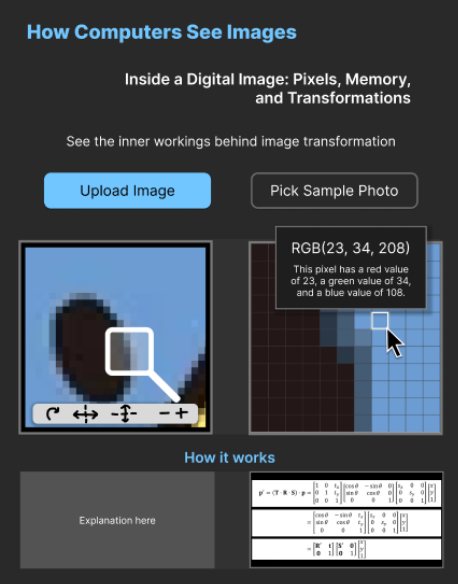

<b>Members:</b>
<ul>
    <li>Chu, Avery Simone</li>
    <li>Saguin, VL Kei</li>
    <li>Sia, Justin Michael</li>
    <li>Sy, Prince Matthew</li>
    <li>Tan, Paul Aiden</li>
</ul>

 

<b>Project Theme:</b> Digital Image Processing

 

<h1>Inside a Digital Image: How Computers Store and Transform Visual Data</h1>

To the human eye, digital images look nothing more than a digital snapshot of real life. A computer, on the other hand, doesn’t see it the same way. In computers, a digital image is stored as a collection of pixels, with each pixel represented by numerical values that describe attributes such as color and transparency. Our proposed exhibit brings its “visitors” through how computers represent visual information in memory by interacting directly with an image and examining its underlying pixel data.

Besides a scrollable home page with explanations of how the mechanism works, users will be able to upload or select any image and see what exactly goes on at the pixel level. By selecting regions of the image, users can zoom in to view individual pixels and inspect their stored values. As users apply various image processing operations, the exhibit demonstrates how mathematical formulas and matrix transformations are used to alter an image. Through these visual and interactive demonstrations, visitors gain a deeper understanding of how computers manipulate images using concepts from data representation, arithmetic operations, and linear algebra.

<h2>Key Features</h2>
<ul>
    <li>Upload an image or select from a set of sample images.</li>
    <li>Interactive split-screen interface displaying the original image and a pixel-level visualization panel.</li>
    <li>Region selection tool that allows users to zoom into specific areas of an image.</li>
    <li>Enlarged pixel grid for examining the structure of digital images.
Pixel inspection tool displaying:</li>
    <li style="list-style-type: none">
        <ul>
            <li>RGB color values</li>
            <li>Opacity (Alpha) values</li>
            <li>Pixel coordinates</li>
        </ul>
    </li>
    <li>Real-time image processing demonstrations, including:</li>
    <li style="list-style-type: none">
        <ul>
            <li>Grayscale conversion</li>
            <li>Brightness adjustment</li>
            <li>Color inversion</li>
            <li>Scaling</li>
            <li>Rotation</li>
        </ul>
    </li>
    <li>Visual explanations showing the formulas used for each transformation.</li>
    <li>Matrix-based transformation demonstrations that illustrate how linear algebra is applied in image processing.</li>
    <li>Side-by-side comparison of the original and transformed images.</li>
    <li>Educational tooltips and explanations connecting image processing concepts to computer architecture and digital data representation.</li>
</ul>

<h2>Tech Stack</h2>
<ul>
    <li>Astro 6</li>
    <li>React 19</li>
    <li>Tailwind CSS</li>
    <li>Native Canvas API</li>
    <li>Native Pointer Events</li>
    <li>Mathjs</li>
    <li>react-dropzone </li>
    <li>Framer-motion</li>
    <li>shadcn/ui</li>
</ul>

<h2>Style Guide Snapshot (1920 x 2482)</h2>
